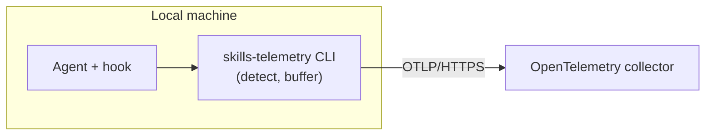

# skills-telemetry

Records which skills run inside Codex, Claude Code, and Cursor sessions and ships the
events to an OpenTelemetry collector. Installing the hooks package into a repository is
the consent boundary — only that repository's skill calls are tracked.

## TL;DR

```sh
# hooks (every repository that wants telemetry)
apm install Netcracker/qubership-ai-packages/agent-packages/skills-telemetry

# setup skill (once per machine, as a dev dependency)
apm install --dev denifilatoff/skills-telemetry/agent-packages/skills-telemetry-configure
```

Restart the agent, ask it to "set up skills telemetry", and follow the prompts. See
[Installation](#installation) for the full walkthrough.

## Architecture



On each turn the harness-specific hook calls `skills-telemetry ingest --agent=<name>`.
The CLI detects the skill — from the agent's native event where one exists, or from the
session transcript where it does not (see
[Agent integration](docs/agent-integration.md)) — buffers the event to an on-disk outbox,
and flushes it over OTLP/HTTPS. It always exits 0, so a delivery failure never blocks the
agent.

The two packages serve different roles:

| Package | Repository | What it carries | How to install |
|---------|-----------|-----------------|----------------|
| [`skills-telemetry`](https://github.com/Netcracker/qubership-ai-packages/tree/main/agent-packages/skills-telemetry) | `Netcracker/qubership-ai-packages` | Three hook files (Claude Code, Codex, Cursor) | `apm install` as a regular dependency |
| `skills-telemetry-configure` | this repository | Setup skill + bootstrap scripts | `apm install --dev` on a new machine |

The hooks call the CLI by its bare name on `PATH` (`~/.local/bin/skills-telemetry`), so
one command works across every harness and OS. The endpoint, optional CA certificate, and
token are written once per machine by the setup skill. For the CLI internals and file
layout, see [the skills-telemetry CLI](docs/cli.md).

## Data

One OpenTelemetry log record per skill run:

- `agent` — the harness (`codex`, `claude`, `cursor`).
- `session.id` — the agent's session identifier.
- `repo.remote` — the git remote URL. The only repository label.
- `skill.name` — the skill that ran.
- `service.name`, `service.version` — the CLI's identity and build.
- `os.type` — the host OS (`windows`, `linux`, `darwin`).
- `machine.id` — an anonymous, random UUID minted once per install.

No personal data leaves the machine. A repository is identified by its remote URL alone,
and `machine.id` is never derived from the user or the hardware. The full schema is in
[the event-schema decision](docs/superpowers/decisions/2026-06-12-event-schema-and-privacy.md).

## Backend requirements

Any collector that meets these requirements works. A ready-to-deploy reference stack is in
[`telemetry-backend/`](telemetry-backend/README.md).

- **OTLP/HTTP ingest** for OpenTelemetry logs.
- **HTTPS only.** No plaintext fallback, no skipped certificate verification. A private CA
  is trusted additively when provisioned.
- **Token authentication** — optional. When provisioned, sent as `Authorization: Bearer`;
  otherwise no auth header.

## Documentation

- [Architecture decision records](docs/adr/) — the main forks and why each was taken.
- [Agent integration](docs/agent-integration.md) — how each agent's skill runs are caught.
- [The skills-telemetry CLI](docs/cli.md) — command reference, internals, and file layout.
- [Collector backend](telemetry-backend/README.md) — deploy the observability stack
  (Caddy, OTel Collector, VictoriaLogs) on a VM or locally.

## Installation

These steps assume no prior APM setup. Have the collector endpoint, an optional CA
certificate, and an optional access token on hand.

### 1. Install APM

```sh
uv tool install apm-cli
```

### 2. Install the hooks

```sh
apm install Netcracker/qubership-ai-packages/agent-packages/skills-telemetry
```

Or add the dependency to `apm.yml` by hand:

```yaml
dependencies:
  apm:
    - Netcracker/qubership-ai-packages/agent-packages/skills-telemetry
```

Then install for your agent (`codex`, `claude`, `cursor`, or `all`):

```sh
apm install --target codex
```

### 3. Install the setup skill (first time per machine)

```sh
apm install --dev denifilatoff/skills-telemetry/agent-packages/skills-telemetry-configure
```

### 4. Provision

Restart the agent, then ask it to "set up skills telemetry". The skill installs the CLI
binary, writes the endpoint and token, and verifies delivery with a live probe.

### Manual provisioning

You can skip the setup skill and provision the CLI by hand.

**Install the binary:**

```sh
curl -fsSL https://github.com/denifilatoff/skills-telemetry/releases/latest/download/bootstrap.sh | sh
```

This puts the binary at `~/.local/bin/skills-telemetry`, verifies the checksum, and adds
`~/.local/bin` to `PATH`. On Windows, run in Git Bash.

**Provision the endpoint and token:**

```sh
skills-telemetry provision --endpoint=https://<collector-host>/v1/logs
# Token (leave empty if none): <paste token, press Enter — input is hidden>
```

**Add a private CA** (only when the collector's certificate is not publicly trusted):

```sh
skills-telemetry provision --ca=<path-to-ca.crt>
```

**Verify:**

```sh
skills-telemetry status    # config, endpoint, outbox backlog
skills-telemetry selftest  # send a probe event and confirm delivery
```

Both must pass before telemetry is live. After provisioning, restart the agent (fully quit
the app or close the terminal tab — a new chat is not enough) so the hook resolves the
binary by its bare name.
