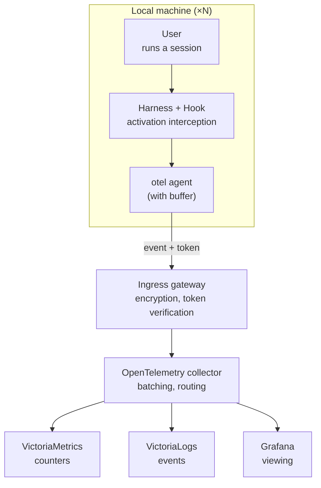

# Options for collecting skill-usage telemetry

Working document. The goal is to record the options we have discussed for capturing **a skill executing within a session** (not the skill being installed on a machine) across four agents: Claude Code, Codex, Cursor, and OpenCode.

Each option follows the same structure: name, the idea, blockers, who it works for, and the verdict. The blockers list only the agents that cannot support the option or support it poorly. The "who it works for" section lists the agents the option works for, with a full account of how. Spec links are included so you can verify the facts yourself.

---

## 1. OTEL telemetry (the vendor's built-in telemetry)

**The idea.** Use the telemetry already built into the agent itself — the OpenTelemetry standard or the vendor's server-side analytics — which reports skill usage on its own. Nothing is added to the skills.

**Blockers (by agent).**
- Codex — no dedicated skill breakdown; telemetry keys are set only at the user level, not the project level. Specs: developers.openai.com/codex/config-reference; github.com/openai/codex/issues/22230
- Cursor — telemetry is server-side only, reachable through the admin panel and only on team plans; there is no skill breakdown; it is unavailable on individual subscriptions. Spec: cursor.com/docs (Analytics / Admin API section)
- OpenCode — no dedicated skill breakdown. Spec: opencode.ai/docs/cli

**Who it works for (by agent).**
- Claude Code — yes. There is a dedicated skill-activation event and an attribute carrying the skill name on the usage and cost metrics. Our skill names are visible only when `OTEL_LOG_TOOL_DETAILS=1` is set; otherwise they are hidden behind the `custom_skill` placeholder. The data flows over the OpenTelemetry standard to our collector. Spec: docs.anthropic.com/en/docs/claude-code/monitoring-usage

**Verdict.** For our metric, only Claude Code qualifies.

---

## 2. Emitting a signal from the skill body — *rejected*

**The idea.** The skill body directs the model to call a local program that sends a usage report.

**Blockers (shared across all four).**
- A conceptual blocker: the skill starts transmitting data the moment it is read, which is covert collection without the user's clear awareness, and it pollutes a shared skill. On top of that, the signal depends on whether the model complies.

**Who it works for.**
- Technically feasible on all four, but acceptable on none.

**Verdict.** Rejected on security and consent grounds.

---

## 3. An MCP server to record skill execution — *rejected*

**The idea.** An operational step of the skill is routed through our server over the Model Context Protocol; each execution is recorded on our side.

**Blockers (shared across all four).**
- The skill stops being portable text and becomes hard-wired to our server, which is unacceptable for a shared catalog. The binding to a session is imprecise. Plain-text skills with no operational step cannot be instrumented this way.

**Who it works for.**
- All four support the protocol, but on acceptability grounds it is rejected.

**Verdict.** Rejected as a distortion of the skill model.

---

## 4. Built-in observation through the agent's programmatic interface

**The idea.** Connect to the agent's server mode and subscribe to its event stream (tool calls, session completion, and so on) from an external process.

**Blockers (by agent).**
- Claude Code — there is no interface for observing an interactive session. Spec: docs.anthropic.com/en/docs/claude-code
- Codex — there is no programmatic subscription to session events. Spec: developers.openai.com/codex/config-reference
- Cursor — there is no programmatic subscription to session events. Spec: cursor.com/docs

**Who it works for (by agent).**
- OpenCode — yes. Start server mode, and an external process subscribes to the event stream and sees tool calls and session completion in real time. The approach is single-vendor. Specs: opencode.ai/docs/cli; opencode.ai/docs/plugins

**Verdict.** Powerful, but OpenCode only.

---

## 5. A deterministic hook on the skill-activation event

**The idea.** An interceptor in the settings layer fires on the native skill-activation event that the agent itself emits and immediately runs a local collector program. The agent supplies the skill name; the skill body is left untouched.

**Blockers (by agent).**
- Codex — a skill is not a tool and emits no activation event, so there is nothing to intercept; hooks are experimental and disabled on Windows. Spec: developers.openai.com/codex/hooks
- Cursor — skill activation is not an event; there is no general skill-activation event. Spec: cursor.com/docs/hooks

**Who it works for (by agent).**
- Claude Code — yes. Skill activation takes two paths: invoking the skill as a tool (caught by the pre-tool-call interceptor) and expanding a slash command (caught by a separate command-expansion event). Both paths have to be handled. The agent passes the skill name to the interceptor, and the skill body is left untouched. Spec: code.claude.com/docs/en/hooks
- OpenCode — yes, when skills are managed through the compatibility extension (the one that provides compatibility with the `.claude/skills/` catalog). Activation goes through a `use_skill` tool call, which injects the skill content into the context; that call is caught by the pre-tool-call interceptor, and the skill name sits in its arguments. Specs: opencode.ai/docs/plugins; the opencode-agent-skills extension docs

**Verdict.** Works deterministically on Claude Code and OpenCode (via `use_skill`). Codex and Cursor have no native skill-activation event.

---

## 6. A session-reading agent on the local machine

**The idea.** A separate program, delivered through the package manager, reads the local session records after the turn and recognizes a skill execution by matching the name against a local list of installed skills.

**Blockers (by agent).**
- Cursor — records live in a local database (SQLite format, the `state.vscdb` file), the schema depends on the version, and skill activation may not be recorded at all — unreliable. There is no official spec; to verify: the Cursor forum and storage write-ups (vibe-replay.com).

**Who it works for (by agent).**
- Claude Code — yes. Clean session records, one file per project, in a line-by-line text format that is easy to read; recognition happens after the turn. Spec: docs.anthropic.com/en/docs/claude-code
- OpenCode — yes. The session export and interface are readable; after the turn. Spec: opencode.ai/docs/cli
- Codex — yes, but the format of the history records and turn logs is less stable; after the turn. Spec: developers.openai.com/codex/config-reference

**Verdict.** A cross-vendor fallback that leaves skills unchanged. Reliable on Claude Code and OpenCode, workable on Codex, unreliable on Cursor.

---

## 7. A visible marker caught by a hook

**The idea.** The skill prints a visible marker in its response (a strict, rare signal) to say it has activated; a separate interceptor in the settings layer catches that text and reports it. Without the interceptor, the marker stays harmless visible text and goes nowhere.

**Blockers (shared across all four).**
- The model, not the agent, emits the signal, so it is probabilistic and undercounts; it needs a strict verbatim marker, or the match is unreliable. The skill body is slightly polluted by the marker string. Good enough for skill-development decisions, but not for strict accounting.

**Who it works for (by agent).**
- Claude Code — caught through turn completion and reading the session record, but the marker is redundant here: there is a native event (see option 5). Spec: code.claude.com/docs/en/hooks
- Cursor — caught by the post-response event (`afterAgentResponse`), which hands over the response text. Spec: cursor.com/docs/hooks
- OpenCode — caught through a message event or the event stream. Spec: opencode.ai/docs/plugins
- Codex — caught through turn completion and reading the history; hooks are experimental. Spec: developers.openai.com/codex/hooks

**Verdict.** The only cross-vendor interception. The price is a probabilistic undercount. On Claude Code it is superseded by the more reliable option 5.

---

## 8. Langfuse directly

**The idea.** Instead of our own telemetry stack, use Langfuse — an open observability platform for language models. One fundamental caveat: Langfuse is a trace (span) visualizer; it accepts only traces, not logs or metrics. It has no concept of a "skill": a skill is visible only where activation is a tool call.

**Blockers (by agent).**
- Claude Code — the built-in telemetry emits logs, not traces, so it does not reach Langfuse directly (the community has confirmed it does not work). That leaves only the LiteLLM proxy, but it requires pointing the base URL at itself and is therefore incompatible with subscription authentication (Claude Max or Pro) — and we are on individual subscriptions; on top of that, it is a central proxy, which runs against decentralization. The skill, meanwhile, is visible only as a tool call inside the request body. Specs: github.com/orgs/langfuse/discussions/9088 ; code.claude.com/docs/en/llm-gateway
- Codex — the same picture: the telemetry is log-based, it needs the LiteLLM proxy, which is incompatible with the ChatGPT subscription; and a skill in Codex is not a tool, so there is nothing to single out in the trace. Spec: docs.litellm.ai/docs/tutorials/openai_codex
- Cursor — a closed client that routes through its own servers; overriding the base URL is limited, there is no clean path into Langfuse, and a skill is not a tool. The worst case.

**Who it works for (by agent).**
- OpenCode — yes, and it is the only one where Langfuse works natively and well. With `experimental.openTelemetry: true`, OpenCode emits spans, and the community plugin `opencode-plugin-langfuse` (MIT) intercepts sessions, messages, tool calls, and cost and sends them to Langfuse. Because skill activation in OpenCode is a tool call, it shows up as a span. Specs: npmjs.com/package/opencode-plugin-langfuse ; opencode.ai/docs
- Claude Code and Codex — nominally "works" only through the LiteLLM proxy, with all the blockers above; in a pure subscription-based, decentralized scenario, no.

**Verdict.** As a replacement for our stack, Langfuse is genuinely justified only for OpenCode (native spans with tool calls). For Claude Code and Codex it works only through a central proxy, which breaks individual subscriptions and decentralization; for Cursor there is practically no path. Skills are visible only where activation is a tool call (OpenCode directly; Claude Code through the proxy by parsing the body), and in Codex and Cursor they are invisible.

---

## Open points

**Installation, scope, and delivery.** The interceptor (or the session-reading agent) is installed as a separate, deliberately installed package — separate from the skills; the skills stay clean, and the consent boundary is the package installation. The package manager is project-oriented (there is no machine-global install), so we install at the repository level, into work repositories: a narrow scope that also separates work from non-work usage. The sender executable rides along as a resource inside the package and lands in the repository; the hook from the same package references it by a path relative to the project root, and the agent itself supplies the root (`${CLAUDE_PROJECT_DIR}` in Claude Code, the working directory in Cursor, `cwd` or the git root in Codex, `directory` in OpenCode) — there is no machine-global address to hunt for. The price is a copy of the sender in every work repository; updates flow normally through installation and the version lock file (`apm.lock.yaml`). The hook itself stays harness-specific: the package manager unifies delivery, but the hook definition is described per agent. In a corporate environment, the same component is rolled out by organization policy (`managed-settings.json` in Claude Code, `requirements.toml` in Codex). For the session-reading agent, scope is set not by installation but by filters (by path, by remote repository URL), since it sees every local session.

**Telling our skills apart.** Inside a work repository, capturing any skill is fine. When we need to single out ours specifically, they are identified by namespace or source right in the activation event (the package manager rolls them out under a known namespace, and a name like `ops:deploy-helm` already says the skill is ours). No separate check against a local list is needed for this, and no markers in the skill body either.

**A fixed telemetry address.** The receiver address is hard-coded into the hook. So installing the hook into a repository is itself the consent to send telemetry to one specific place, not a configurable one; where it goes is visible in the hook text. The access token, meanwhile, is better issued as an organization secret than committed to git.

**Authentication (open question).** The gateway has to authenticate incoming events, and the token has to reach each machine somehow — and here lies the tension with decentralization: there is no central machine management, and we do not put the token in git. Sub-questions to resolve: a shared token for everyone versus a personal one per participant (personal is better for attribution and revocation); where the participant gets it (self-service through an internal portal via corporate sign-on is the most realistic); how the token reaches the machine outside git (an environment variable or a local secret file that the sender reads); how to rotate and revoke it. To be settled before rollout.

---

## Topology

The system components and the data flow. Role color: the interception point (the agent with the hook), our telemetry components (sender, collector), and the infrastructure and storage.

Flow: the user runs a session in the agent → the agent activates a skill and, through the hook, runs a local sender program (an OTEL agent with a buffer) → the sender buffers to disk and sends over the OpenTelemetry protocol (with an access token) → through an ingress gateway with token verification and encryption → into a shared OpenTelemetry collector → onward to counters in VictoriaMetrics, events in VictoriaLogs, and viewing in Grafana.

Notes on the topology:
- The sender is one per work repository (it rides along as a package resource and is updated through installation). The hook registration is in the same place, at the repository level. The hook does not search for the sender; it calls it by a path relative to the project root that the package manager wrote.
- The gateway and collector are a network receiver, not machine management; decentralization is preserved.
- A single collector receives events from all agents and from Claude Code's built-in telemetry, folding them into one model.

---

## Sourcing the telemetry data

Below is where the sender takes each event field from, broken down by agent. The fields in code (`session_id`, `cwd`, and so on) are the names in the corresponding agent's hook input — match against those.

### Universal fields (the same across all four agents)

`service.name` and `service.version` are constants inside the sender. `ts` is the moment of sending. `machine.id` is an anonymous per-install identifier the sender generates locally: a random UUID stored on the machine, never derived from the user or the hardware. It exists only to tell installs apart, not to identify the user. The exception: Cursor can hand over the user's email right in the input (the `user_email` field, optional) — see the table.

### Agent-dependent fields

| Field | Claude Code | Codex | Cursor | OpenCode |
|---|---|---|---|---|
| `agent` (identity) | from the hook registration (a flag in the package-manager template); not in the input | from the hook registration; not in the input (`model` is the model, not the agent) | from the hook registration | from the registration / plugin context |
| `agent.version` | not in the input; via `claude --version` or the environment | not in the input; via `codex --version` | in the input: `cursor_version` (optional) | via `opencode --version` or the programmatic interface |
| `session.id` | `session_id` in the input | `session_id` in the input (`turn_id` is available but not emitted) | `conversation_id` (+ `generation_id`) in the input | `sessionID` in the hook input |
| `repo` | from `cwd` → root and remote repository URL via git | from `cwd` → git (Codex also finds the root by `.git` itself) | from `workspace_roots` (the root is already given) → git | from `directory` / `worktree` in the plugin context → git |
| `skill.name` | **yes**: `command_name` (command expansion) or `tool_input` on the Skill tool (before the tool call) | **not in the hook** (a skill is not a tool; hooks are Bash-only) → marker or session reading | **not in the hook** (a skill is not a tool) → marker (`afterAgentResponse.text`) or session reading | **yes**: the skill-activation tool call (for example `use_skill`), name in `args` — when skills are managed through the compatibility extension |
| `skill.version` | **not in the input** → match the name against the package-manager manifest, or take it from the marker | **not in the hook** → the marker carries the version, or the manifest (if the name is sourced some other way) | **not in the hook** → the marker carries the version, or the manifest | **not in `args`** → the manifest by name, or from the marker |

Two asymmetries to keep in mind:
- The skill name comes from the event itself only on Claude Code and OpenCode. Codex and Cursor have no skill-activation event, so the name is sourced only from the visible marker or from reading the session records.
- The skill version does not come in the event on any of them. It is supplied either by matching the name against the package-manager manifest or by the visible marker (which carries both name and version at once — the only way without a manifest, and the only source of anything at all on Codex and Cursor).

### Spec links to verify (by agent)

- Claude Code — hook input, `command_name` on command expansion, the path through the Skill tool: code.claude.com/docs/en/hooks
- Codex — hook events and fields, the "Bash-only" limitation: developers.openai.com/codex/hooks ; developers.openai.com/codex/config-advanced ; the request for skill observability: github.com/openai/codex/issues/22230
- Cursor — input fields (`conversation_id`, `generation_id`, `workspace_roots`, `cursor_version`, `user_email`, `transcript_path`), the `afterAgentResponse` event with the response text: cursor.com/docs/hooks
- OpenCode — plugin structure (`directory`, `worktree`, `client`), the `tool.execute.before` input (`tool`, `sessionID`, `callID`, `args`), skill activation through the compatibility tool: opencode.ai/docs/plugins
