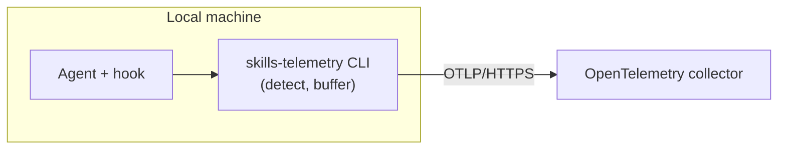

# skills-telemetry

Skill-usage telemetry for AI coding agents. It records when a skill runs inside a
session — across Codex, Claude Code, and Cursor — and ships the event to a shared
OpenTelemetry collector.

## TL;DR

To turn telemetry on for your repository, install the `qubership-skills-telemetry` APM
package, restart your agent, and ask it to "set up skills telemetry". See
[Installation](#installation) for the full steps.

Have these on hand before you start:

- the collector endpoint (an `https://` URL);
- the CA certificate, if the collector uses a private one;
- an access token, if the collector expects one.

## What it does

Each supported agent reports the skills it runs, so a team can see which skills get
used and how often. The event carries the agent, the session, the repository remote,
and the skill name — nothing more (see [Data](#data)).

Installing the APM package into a repository is the consent boundary. Nothing is sent
until you install the package and run the setup skill, the scope is the repository you
installed it into, and the collector address is fixed in the hook the package writes.

## Architecture

The package delivers three things into your repository: a harness-specific hook, the
`skills-telemetry` CLI (a small Go binary), and the setup skill. The flow on each turn:

1. The agent runs a skill and fires the hook the package registered.
2. The hook runs the CLI, which detects the skill from the agent's payload — a native
   event where the agent emits one, the session transcript where it does not (see
   [Agent integration](docs/agent-integration.md)).
3. The CLI buffers the event to an on-disk outbox, then flushes it over OTLP/HTTPS to
   the collector.

The endpoint, optional CA certificate, and optional token are written once per machine
by the setup skill. The hook calls the CLI by its bare name; the setup skill installs the
binary to `~/.local/bin` and puts that directory on `PATH`, so one shell-agnostic hook
command works across every harness and OS. For its internals and file layout, see
[the skills-telemetry CLI](docs/cli.md).



## Data

One OpenTelemetry log record per skill run. It carries:

- `agent` — the harness that produced the event (`codex`, `claude`, `cursor`).
- `session.id` — the agent's session identifier.
- `repo.remote` — the git remote URL, when one resolves. The only repository label.
- `skill.name`, `skill.source` — the skill that ran.
- `service.name`, `service.version` — the CLI's identity and build.
- `os.type` — the host operating system (`windows`, `linux`, `darwin`), an
  OpenTelemetry semantic-convention attribute.
- `machine.id` — an anonymous, random UUID minted once per install.

No personal data leaves the machine. The local path is never sent — a repository is
identified by its remote URL alone — and `machine.id` is never derived from the user
or the hardware. The schema and the reasoning behind it are in
[the event-schema decision](docs/superpowers/decisions/2026-06-12-event-schema-and-privacy.md).

## Backend requirements

Any collector that meets these requirements works. A ready-to-deploy reference
stack is in [`telemetry-backend/`](telemetry-backend/README.md). The CLI expects:

- **OTLP/HTTP ingest** for OpenTelemetry logs.
- **HTTPS only.** The CLI never falls back to plaintext, never skips certificate
  verification, and trusts a private CA additively when one is provisioned.
- **Token authentication** — optional. When a token is provisioned, the CLI sends it as
  an `Authorization: Bearer` header; without one, the request carries no auth header.

## Documentation

- [Design decisions](docs/design-decisions.md) — the main forks and why each was taken.
- [Agent integration](docs/agent-integration.md) — how each agent's skill runs are caught.
- [The skills-telemetry CLI](docs/cli.md) — the command reference, internals, and file layout.
- [Collector backend](telemetry-backend/README.md) — deploy the observability stack (Caddy, OTel Collector, VictoriaLogs) on a VM or locally.

## Installation

The setup skill is the normal path. These steps assume no prior APM setup.

### 1. Install APM

skills-telemetry ships as an [APM](https://github.com/microsoft/apm) package, so you need
the APM CLI. Install it with [uv](https://docs.astral.sh/uv/):

```sh
uv tool install apm-cli
```

### 2. Install the package

Add the package one of two ways. Via the APM command:

```sh
apm install denifilatoff/skills-telemetry/agent-packages/qubership-skills-telemetry
```

Or add the dependency to your `apm.yml`:

```yaml
dependencies:
  apm:
    - denifilatoff/skills-telemetry/agent-packages/qubership-skills-telemetry#v0.6.1
```

Then install and compile for your agent. `--target` is one of `codex`, `claude`,
`cursor`, or `all` to cover every installed agent:

```sh
apm install --target codex
apm compile --target codex
```

This deploys the telemetry hook and the setup skill, and merges the skill trigger into
the agent's instructions. Installing is the consent boundary — nothing is sent until you
run the setup skill.

### 3. Run the setup skill

Restart your agent, then ask it to "set up skills telemetry". The bundled
`provision-skills-telemetry` skill asks for the collector endpoint (and a CA or token
where the collector needs one), writes the per-machine config, and verifies the pipeline
with a live probe.

### Manual provisioning

The setup skill is the easiest path, but you can provision the CLI by hand. You
need three things from whoever runs the collector: the endpoint URL, a CA
certificate (only if the collector uses a private CA), and a token (only if the
collector requires one).

**Install the binary** (skip if the setup skill already placed it):

```sh
curl -fsSL https://github.com/denifilatoff/skills-telemetry/releases/latest/download/bootstrap.sh | sh
```

This puts the binary at `~/.local/bin/skills-telemetry` (`.exe` on Windows),
verifies the download checksum, and adds `~/.local/bin` to the user `PATH`. On
Windows, run the command in Git Bash. Open a new terminal so the updated `PATH`
takes effect.

**Provision the endpoint and token:**

```sh
skills-telemetry provision --endpoint=https://<collector-host>/v1/logs
# Token (leave empty if none): <paste token, press Enter — input is hidden>
```

The binary reads the token from the terminal without echo, so it never appears on
screen or in shell history. If the collector does not require a token, press Enter
on an empty prompt.

**Add a private CA** (only when the collector's certificate is not publicly trusted):

```sh
skills-telemetry provision --ca=<path-to-ca.crt>
```

**Verify:**

```sh
skills-telemetry status    # check config: endpoint, CA, provisioned verdict
skills-telemetry selftest  # send a probe event and confirm the collector accepted it
```

`status` is read-only — it shows the config directory, endpoint, whether a CA is
present, and the outbox backlog. `selftest` sends one real event and reports
whether it left the outbox. Both must pass before telemetry is live.

After provisioning, restart your agent (fully quit the app or close the terminal
tab — a new chat is not enough) so the hook resolves the binary by its bare name.
